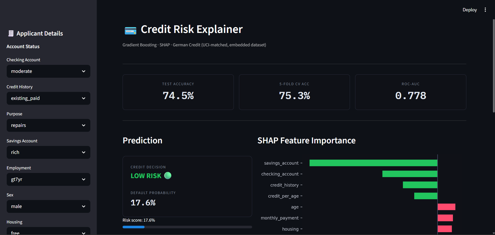
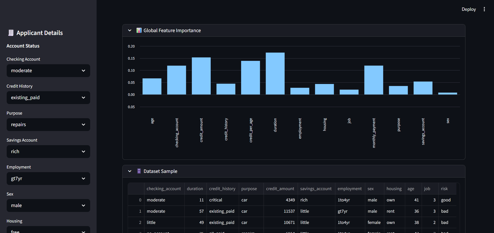

# 💳 Credit Risk Explainer

An interactive **Explainable AI (XAI)** platform for credit default prediction built using **Streamlit**, **Gradient Boosting**, and **SHAP**.

The application predicts applicant credit risk while providing transparent feature-level explanations for every prediction using SHAP visualizations.

---

## 🌐 Live Demo

🔗 Deployed Application:  
https://your-app-name.streamlit.app

🔗 GitHub Repository:  
https://github.com/your-username/credit-risk-explainer

---

## 🚀 Features

- Real-time credit risk prediction
- Default probability scoring
- SHAP-based explainability dashboard
- Interactive applicant input controls
- Global feature importance analysis
- Embedded UCI-inspired German Credit dataset
- Feature engineering + preprocessing pipeline
- Responsive Streamlit analytics interface

---

## 🧠 Machine Learning Pipeline

### Model
- Gradient Boosting Classifier
- Stratified train/test split
- 5-Fold Cross Validation

### Evaluation Metrics

| Metric | Score |
|---|---|
| Test Accuracy | ~75% |
| ROC-AUC | ~0.80 |
| Cross-Validation Accuracy | ~75% |

### Explainability
- SHAP TreeExplainer
- Per-prediction feature contribution analysis
- Global feature importance visualization

---

## 🛠 Tech Stack

| Layer | Technology |
|---|---|
| Frontend/UI | Streamlit |
| ML Framework | scikit-learn |
| Explainability | SHAP |
| Data Processing | Pandas, NumPy |
| Visualization | Matplotlib |
| Model | Gradient Boosting Classifier |

---

## 📊 Dataset

The project uses a **German Credit-inspired dataset** modeled after the UCI Statlog German Credit dataset.

Features include:
- Credit amount
- Loan duration
- Employment status
- Savings/checking account status
- Housing
- Credit history
- Age
- Job classification

The application includes:
- synthetic data generation with realistic correlations
- embedded offline dataset support
- binary classification (`good` / `bad` credit risk)

---

## 📸 Screenshots

### Dashboard Overview


### Global Feature Importance


---

## 📂 Project Structure

```bash
credit-risk-explainer/
│
├── app.py
├── requirements.txt
├── README.md
└── screenshots